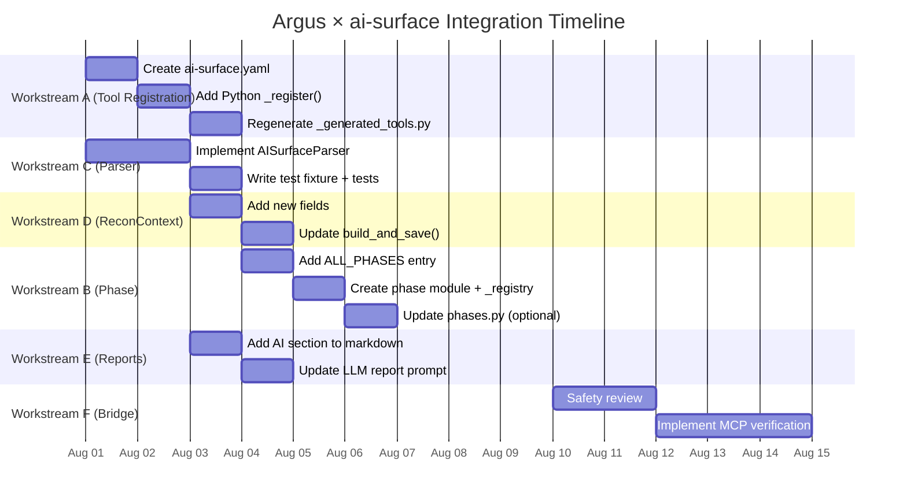

# Argus × ai-surface — Comprehensive Integration Plan

> **Status:** Implementation blueprint  
> **Reference repo:** [apisec-inc/AI-Surface](https://github.com/apisec-inc/AI-Surface) (v1.0.7, cloned to `Argus-repo/AI-Surface/`)  
> **Target:** Integrate `ai-surface` as a first-class tool in Argus's scanning pipeline  
> **Total effort (safe, detection-only):** ~4.5 days  
> **With bridge verification (separately gated):** ~7.5 days

---

## Table of Contents

1. [AI-Surface Architectural Overview](#1-ai-surface-architectural-overview)
2. [Argus Codebase Map for the Integration](#2-argus-codebase-map-for-the-integration)
3. [Workstream A: Tool Registration](#3-workstream-a-tool-registration)
4. [Workstream B: New `source_analysis` Phase](#4-workstream-b-new-source_analysis-phase)
5. [Workstream C: Parser — JSON to Findings](#5-workstream-c-parser--json-to-findings)
6. [Workstream D: ReconContext Extension](#6-workstream-d-reconcontext-extension)
7. [Workstream E: Confidence & Report Integration](#7-workstream-e-confidence--report-integration)
8. [Workstream F: The Verification Bridge (Separately Gated)](#8-workstream-f-the-verification-bridge-separately-gated)
9. [Sequencing & Dependencies](#9-sequencing--dependencies)
10. [Open Items Requiring Pre-Implementation Checks](#10-open-items-requiring-pre-implementation-checks)

---

## 1. AI-Surface Architectural Overview

### 1.1 Project Structure

The `ai-surface` CLI (`apisec-inc/AI-Surface`, v1.0.7) is a Python-based static analysis tool that maps AI attack surfaces from source code. Its internal architecture follows a pipeline pattern:

```
src/ai_surface/
├── cli.py                    # Typer CLI entry point (scan, compare commands)
├── orchestrator.py           # Runs detectors, assembles Report
├── types.py                  # Core data model (Finding, Evidence, Audit, Report)
├── verdicts.py               # Confirmed vs Likely risk classification
├── dispositions.py           # resolve-here vs validate-runtime classification
├── cross_promo.py            # Bridge links to runtime validation platform
├── audits.py                 # Deep-dive audit enrichment
├── oversight.py              # Human-oversight gap detection (EU AI Act Art. 14)
├── observability.py          # Observability gap detection (EU AI Act Art. 12)
├── pii.py                    # PII-into-prompt detection (EU AI Act Art. 10)
├── frameworks.py             # Governance framework evidence
├── diff.py                   # Baseline comparison engine
├── detectors/
│   ├── mcp_audit.py          # MCP server discovery + deep-dive audit
│   ├── agent_frameworks.py   # Agent framework detection (11 Python + 7 JS/TS)
│   ├── llm_sdks.py           # LLM SDK call site detection (13 providers)
│   ├── env_keys.py           # AI provider key name detection
│   ├── model_gateways.py     # LiteLLM, Portkey, etc.
│   ├── ai_infra.py           # K8s, Terraform, Docker AI workloads
│   ├── api_endpoints.py      # HTTP/REST endpoints from route decorators + OpenAPI
│   └── vector_rag.py         # Vector stores + RAG pipelines (13 stores, 2 frameworks)
├── reporters/
│   ├── json_reporter.py      # Schema 1.0 JSON output
│   ├── terminal_reporter.py  # Rich-styled terminal output
│   ├── markdown_reporter.py  # Markdown for PR comments
│   ├── cyclonedx_reporter.py # AI-BOM (CycloneDX)
│   └── sarif_reporter.py     # SARIF 2.1.0 for GitHub code scanning
├── utils/
│   ├── walk.py               # File walker with .gitignore + safety caps
│   └── ...
└── data/
    └── mcp/                  # Bundled MCP registry, risk definitions, secret patterns
```

### 1.2 Pipeline Flow

```
CLI (cli.py)
  │
  ▼
Orchestrator (orchestrator.py)
  │
  ├── Step 1: Run all detectors → list[Finding]
  │   └── Each detector (Detector protocol):
  │       class Detector(Protocol):
  │           name: str           # e.g. "mcp_audit"
  │           category: str       # e.g. "mcp-server"
  │           def detect(root_path: str) -> list[Finding]
  │
  ├── Step 2: Enrich audits (audits.py)
  ├── Step 3: Enrich oversight gaps (oversight.py)
  ├── Step 4: Enrich observability gaps (observability.py)
  ├── Step 5: Enrich PII-into-prompt (pii.py)
  ├── Step 6: Attach verdicts (verdicts.py) — confirmed vs likely
  ├── Step 7: Attach dispositions (dispositions.py) — resolve vs validate
  └── Step 8: Attach bridges (cross_promo.py) — runtime validation URLs
       │
       ▼
  Report (aggregated)
       │
       ▼
  Reporters (json/terminal/markdown/cyclonedx/sarif/ui)
```

### 1.3 Core Data Model (types.py)

```python
@dataclass
class Evidence:
    files: list[str]                    # File paths relative to scan root
    snippet: str                        # Short code/config snippet (~200 chars)
    line_numbers: list[int]             # Optional line references
    metadata: dict[str, Any]            # Detector-specific (model names, tool lists)

@dataclass
class RiskFlag:
    flag: str                           # Machine id: "financial-action", "secrets-in-env"
    severity: str                       # critical|high|medium|low|info
    description: str                    # Plain-English explanation
    owasp: list[str]                    # ["LLM06", "LLM02"]
    remediation: str                    # Fix guidance
    standards: list[dict]               # [{"framework": "EU AI Act", "clause": "Art. 9"}]

@dataclass
class Audit:
    risk_flags: list[RiskFlag]          # Assessed risks
    secrets: list[Secret]               # Name+type only, never the value
    trust_score: float | None           # 0-100 from registry
    trust_label: str                    # verified|community|unknown
    owasp_mappings: list[str]           # Flattened OWASP ids

@dataclass
class Bridge:
    sku: str                            # mcp-runtime|agent-validation|api-runtime
    label: str                          # User-facing CTA
    url: str                            # Deep link (UTM-tagged)
    status: str                         # live|coming

@dataclass
class Finding:
    surface: str                        # Display name e.g. "MCP Server: stripe-mcp"
    category: str                       # 8 categories
    evidence: Evidence
    permissions: list[str]              # Exposed tools/capabilities
    risk_indicators: list[str]          # Plain-English, severity-free flags
    detector_name: str
    severity: str | None                # None = inventoried, not assessed
    audit: Audit | None                 # None for inventory findings
    bridges: list[Bridge]
    disposition: str                    # resolve-here | validate-runtime
    runtime_status: str | None          # live | coming | n/a
    runtime_question: str | None        # The question only runtime can answer
    verdict: str | None                 # confirmed | likely | None

@dataclass
class Report:
    findings: list[Finding]
    scan_root: str                      # Basename only (privacy-safe)
    scan_timestamp: str
    detectors_run: list[str]
    schema_version: str                 # "1.0"
    tool_version: str
    repository: str
    errors: list[str]                   # Per-detector failures
    summary: Summary | None             # Aggregates for UI/CI
```

### 1.4 Eight Detection Categories

| Category constant | Human label | Severity? | Disposition |
|---|---|---|---|
| `mcp-server` | MCP Servers | Yes (from audit) | validate-runtime |
| `agent-framework` | Agent Frameworks | Yes (from audit) | validate-runtime |
| `llm-sdk` | LLM SDK Call Sites | No (inventory) | resolve-here |
| `env-key` | AI Provider Keys | No (inventory) | resolve-here |
| `model-gateway` | Model Gateways | No (inventory) | resolve-here |
| `ai-infra` | AI Infrastructure | No (inventory) | resolve-here |
| `api` | API Endpoints | No (inventory) | validate-runtime |
| `vector-store` | Vector Stores / RAG | No (inventory) | resolve-here |

### 1.5 Verdict System (verdicts.py)

The verdict system is a deterministic flag-based classifier:

```python
CONFIRMED_FLAGS = {
    "shell-access", "filesystem-access", "filesystem-write",
    "database-access", "network-access", "secrets-detected",
    "secrets-in-env", "admin-credentials", "remote-mcp",
    "financial-action", "destructive-action", "messaging-action",
    "broad-permissions", "high-blast-radius", "excessive-agency",
}

LIKELY_FLAGS = {
    "unverified-source", "local-binary", "inferred-capability",
    "duplicate-capability", "pii-to-llm", "no-human-oversight",
    "no-observability",
}

def verdict_for(finding: Finding) -> str | None:
    if finding.audit:
        if finding.audit.secrets:
            return VERDICT_CONFIRMED  # "confirmed"
        if any(rf.flag in CONFIRMED_FLAGS for rf in finding.audit.risk_flags):
            return VERDICT_CONFIRMED
        if finding.audit.risk_flags:
            return VERDICT_LIKELY     # "likely"
    if finding.risk_indicators or finding.severity:
        return VERDICT_LIKELY
    return None  # pure inventory
```

### 1.6 JSON Output Schema (Schema v1.0)

The canonical output format is JSON (frozen contract in `docs/SCHEMA_v1.md`):

```json
{
  "schema_version": "1.0",
  "tool_version": "1.0.7",
  "scan_root": "demo-app",
  "scan_timestamp": "2026-07-17T19:21:34.839241+00:00",
  "detectors_run": ["mcp_audit", "llm_sdks", "agent_frameworks", ...],
  "findings_count": 19,
  "summary": {
    "total_findings": 19,
    "by_category": {"mcp-server": 3, "llm-sdk": 3, "agent-framework": 3, ...},
    "by_severity": {"medium": 1, "high": 3},
    "top_risks": ["MCP Server: stripe-mcp: ..."],
    "bridges_available": ["mcp-runtime", "agent-validation", "api-runtime"],
    "resolve_here_count": 9,
    "validate_runtime_count": 10,
    "confirmed_count": 4,
    "likely_count": 11
  },
  "findings": [
    {
      "surface": "MCP Server: stripe-mcp",
      "category": "mcp-server",
      "evidence": {
        "files": [".mcp.json"],
        "snippet": "\"stripe-mcp\": {",
        "line_numbers": [],
        "metadata": {
          "server_name": "stripe-mcp",
          "source": "config",
          "server_type": "npm",
          "mcp_source": "@stripe/mcp-server",
          "tools": ["read_charges", "refund", "customer:read"],
          "config_keys": ["args", "command", "tools"]
        }
      },
      "permissions": ["read_charges", "refund", "customer:read"],
      "risk_indicators": ["unverified source", "financial action exposed"],
      "detector_name": "mcp_audit",
      "severity": "high",
      "audit": {
        "risk_flags": [
          {
            "flag": "unverified-source",
            "severity": "medium",
            "description": "MCP is not from a known/verified publisher",
            "owasp": ["LLM03"],
            "remediation": "Review the source before use",
            "standards": [{"framework": "ISO 42001", "framework_id": "iso-42001", "clause": "A.10"}]
          },
          {
            "flag": "financial-action",
            "severity": "high",
            "description": "MCP exposes financial tools (refund, charge, payout) to the model.",
            "owasp": ["LLM06"],
            "remediation": "Gate financial tools behind human approval.",
            "standards": [{"framework": "EU AI Act", "framework_id": "eu-ai-act", "clause": "Art. 9"}]
          },
          {
            "flag": "no-human-oversight",
            "severity": "high",
            "description": "High-risk action (financial-action) runs with no human approval",
            "owasp": ["LLM06", "LLM09"],
            "remediation": "Put a human-in-the-loop approval step in front of this action",
            "standards": [{"framework": "EU AI Act", "framework_id": "eu-ai-act", "clause": "Art. 14"}]
          }
        ],
        "secrets": [],
        "trust_score": 90.0,
        "trust_label": "verified",
        "registry_match": "known",
        "owasp_mappings": ["LLM03", "LLM06", "LLM09"]
      },
      "bridges": [
        {
          "sku": "mcp-runtime",
          "label": "Coming soon: MCP runtime validation in APIsec",
          "url": "https://www.apisec.ai/products?category=mcp-server&risk=financial-action&...",
          "status": "coming"
        }
      ],
      "disposition": "validate-runtime",
      "runtime_status": "coming",
      "runtime_question": "Can this MCP server's tools be abused at runtime?",
      "verdict": "confirmed"
    }
  ],
  "errors": []
}
```

### 1.7 MCP Finding Evidence — What's Available for the Bridge

For config-declared MCP servers (`.mcp.json`), the `evidence.metadata` contains:

```python
metadata = {
    "server_name": "stripe-mcp",
    "source": "config",
    "server_type": "npm",           # npm | python | remote | local | docker
    "mcp_source": "@stripe/mcp-server",  # Package name or URL
    "tools": ["read_charges", "refund", "customer:read"],
    "config_keys": ["args", "command", "tools"],
    # For remote MCPs:
    "reaches": [{"category": "sse", "url": "https://mcp.github.com/sse", "source_key": "url"}],
    # For in-house MCP servers:
    # mcp_source = file path, server_type = "python" or "node"
}
```

For in-house MCP server source code (`src/orders_mcp_server.py`):

```python
metadata = {
    "tools": ["lookup_order", "refund_payment", "cancel_order", "delete_customer"],
    "source": "code"
}
```

---

## 2. Argus Codebase Map for the Integration

### 2.1 Key Files to Modify

| File | Responsibility | Workstream |
|---|---|---|
| `argus-workers/tools/definitions/ai-surface.yaml` (new) | Tool YAML definition | A |
| `argus-workers/tool_definitions.py` | Python-side `_register()` + phase gating | A, B |
| `argus-workers/_generated_tools.py` | Auto-generated from YAML | A |
| `argus-workers/parsers/parsers/ai_surface.py` (new) | Parser for ai-surface JSON output | C |
| `argus-workers/parsers/normalizer.py` | Finding normalization | C |
| `argus-workers/models/recon_context.py` | Extended with ai-surface fields | D |
| `argus-workers/orchestrator_pkg/recon_context_service.py` | Build context from findings | D |
| `argus-workers/orchestrator_pkg/planning/phases/_registry.py` | Add `source_analysis` phase | B |
| `argus-workers/orchestrator_pkg/planning/phases/ai_surface_analysis.py` (new) | Phase activation + tools | B |
| `argus-workers/orchestrator_pkg/planning/adaptive_planner.py` | Signal-driven phase planning | B |
| `argus-workers/orchestrator_pkg/planning/phases/_types.py` | Shared types | B |
| `Argus-Tui/packages/opencode/src/argus/engagement/confidence.ts` | Confidence pipeline | E |
| `argus-workers/llm_report_generator.py` | LLM report rendering | E |
| `argus-workers/tools/executive_report_generator.py` | Executive report rendering | E |
| `argus-workers/tools/post_exploitation.py` | Bridge: MCP runtime validation | F |
| `argus-workers/phases.py` | Engagement lifecycle states | B |
| `argus-workers/tests/fixtures/ai_surface_sample.json` (new) | Parser test fixture | C |
| `argus-workers/tests/test_ai_surface_parser.py` (new) | Parser tests | C |

### 2.2 Existing Conventions to Follow

**Tool registration (dual system):**
```
YAML (tools/definitions/ai-surface.yaml)
  → _generated_tools.py (auto-generated)
  → tool_definitions.py imports + may override with inline _register()
```

**Phase registration (dual system):**
```
tool_definitions.py ALL_PHASES → tool execution phases
phases.py PHASES                → engagement lifecycle states
planning/phases/_registry.py    → adaptive planner phase definitions
```

**Parser pattern:**
```python
# parsers/parsers/base.py
class BaseParser(ABC):
    @abstractmethod
    def parse(self, raw_output: str) -> list[dict]: ...
```

**JSON parser template (bandit.py):**
```python
class BanditParser(BaseParser):
    def parse(self, raw_output: str) -> list[dict]:
        findings = []
        data = json.loads(raw_output)
        for issue in data.get("results", []):
            findings.append({
                "type": f"BANDIT_{issue.get('test_id', 'UNKNOWN')}",
                "severity": severity,
                "endpoint": f"file:{issue.get('filename', '')}:{issue.get('line_number', 0)}",
                "evidence": {"file": ..., "line": ..., "code": ...},
                "confidence": 0.90,
                "tool": "bandit",
            })
        return findings
```

**Signal-based gate pattern:**
```python
ToolRequires(recon_signals=["has_source_access"])  # in Python registration
```

**Adaptive planner phase pattern:**
```python
# orchestrator_pkg/planning/phases/_registry.py
_PhaseDefinition(
    name="ai_surface_analysis",
    description="AI attack-surface scanning (MCP, agents, LLMs, RAG, gateways)",
    order=15,  # Early: after recon, before scan
    activate_fn=ai_surface_analysis._activate_ai_surface_analysis,
    tools_fn=ai_surface_analysis._ai_surface_tools,
    depends_on=["tech_deep_scan"],
)
```

---

## 3. Workstream A — Tool Registration

### 3.1 Create YAML Definition

File: `argus-workers/tools/definitions/ai-surface.yaml`

```yaml
name: ai-surface
command: ai-surface
description: "Static AI attack-surface scanner: MCP servers, agent frameworks, LLM calls, model gateways, vector stores, exposed provider keys"
args:
  - "scan"
parameters:
  - name: target_path
    type: string
    description: "Path to the source code root to scan"
    required: true
    flag: null                                # Positional argument — no flag
  - name: output_format
    type: string
    description: "Output format (json|markdown|terminal|cyclonedx|sarif)"
    required: false
    flag: "--output"
    default: "json"
  - name: fail_on
    type: string
    description: "Severity gate threshold (critical|high|medium|low)"
    required: false
    flag: "--fail-on"
    default: "high"
  - name: verbose
    type: boolean
    description: "Verbose output"
    required: false
    flag: "--verbose"
    default: false
capabilities:
  - ai_surface_mapping
signal_quality: CONFIRMED
risk_level: low
priority: 80
cost: medium
enabled: true
timeout: 300
```

**Key decisions:**
- `flag: null` for positional args — the generator script (`scripts/generate_tool_defs.py`) handles this by omitting the `flag=` kwarg
- `capabilities: [ai_surface_mapping]` — a new capability that `CAPABILITY_TO_PHASES` in `generate_tool_defs.py` maps to phases (see Workstream B)
- `signal_quality: CONFIRMED` — ai-surface findings are from static code analysis, so "the risk is a fact of the code as written"

### 3.2 Python-Side Registration (Inline Override)

In `argus-workers/tool_definitions.py`, after the YAML import:

```python
_register(
    ToolDefinition(
        name="ai-surface",
        description="Static AI attack-surface scanner: MCP servers, agent frameworks, LLM calls, model gateways, vector stores, exposed provider keys",
        phases=["source_analysis"],         # NEW phase (see Workstream B)
        binary="ai-surface",
        default_args=["scan", "--output", "json"],
        parameters=[
            ToolParameter("target", "Target path to scan (positional)", required=True),
            ToolParameter("output_format", "Output format", flag="--output", default="json"),
            ToolParameter("fail_on", "Gate threshold", flag="--fail-on", default="high"),
        ],
        timeout=300,
        signal_quality=SignalQuality.CONFIRMED,
        requires=ToolRequires(recon_signals=["has_source_access"]),
        priority=80,
        cost="medium",
        risk_level="low",
    )
)
```

### 3.3 Add to Internal Tools List

In `tool_definitions.py`, add `"ai-surface"` to `_AGENT_INTERNAL_TOOLS` if it should always be considered "available" (e.g., if it's installed as a Python package in the worker's venv rather than as a standalone binary on PATH).

```python
_AGENT_INTERNAL_TOOLS = frozenset({
    # ... existing tools ...
    "ai-surface",  # Installed via pip in the worker environment
})
```

If ai-surface is a standalone binary (not a Python package in the venv), skip this — `is_tool_available()` will check the system PATH normally.

### 3.4 Run Generator

```bash
cd argus-workers
python scripts/generate_tool_defs.py            # Regenerate _generated_tools.py
python scripts/generate_tool_defs.py --check     # CI mode: verify consistency
python scripts/check_tool_registry_drift.py      # Check TS vs Python sync
```

### 3.5 Register in TS Tool Registry (for the Planner)

In `Argus-Tui/packages/opencode/src/argus/workflows/tool-definitions.yaml`:

```yaml
  - name: ai-surface
    label: AI Surface Scanner
    capabilities:
      - ai_surface_mapping
    requires_auth: false
    destructive: false
    supports_api: false
    supports_web: false
    supports_source: true
    timeout_seconds: 300
    scoring:
      confidence_score: 90
      coverage_score: 80
    consumes: [source_code]
    provides: [ai_surfaces, mcp_servers, agent_frameworks, llm_sdks]
    cost: medium
```

---

## 4. Workstream B — New `source_analysis` Phase

### 4.1 Understanding Argus's Three Phase Systems

This is the most critical architectural insight. Argus has **three separate phase systems**, and `source_analysis` needs to be added to all that are relevant:

| System | File | Purpose | Example entry |
|---|---|---|---|
| **Tool phases** | `tool_definitions.py:79` | Execution ordering for tool dispatch | `"source_analysis"` |
| **Adaptive planner phases** | `planning/phases/_registry.py` | Signal-driven phase activation | `_PhaseDefinition(...)` |
| **Engagement lifecycle states** | `phases.py` | State machine for engagement tracking | `Phase(id="source_analysis", ...)` |

### 4.2 Add to ALL_PHASES (Tool Phases)

In `argus-workers/tool_definitions.py`:

```python
ALL_PHASES = (
    "recon",
    "source_analysis",    # NEW: AI surface scanning from source
    "scan",
    "deep_scan",
    "repo_scan",
    "analyze",
    "post_exploit",
    "report",
)
```

**Sequencing rationale:** `source_analysis` runs after `recon` but before `scan`. Its findings (MCP servers, agent tools, API endpoints) should feed into the attack composition/chain planning system to inform which tools and phases should activate next.

### 4.3 Add Adaptive Planner Phase Definition

**Create the activation module:** `argus-workers/orchestrator_pkg/planning/phases/ai_surface_analysis.py`:

```python
"""AI surface analysis phase — activated when source code access is available."""

from __future__ import annotations

from orchestrator_pkg.planning.phases._types import ToolTask, _get_attr


def _activate_ai_surface_analysis(recon_context) -> tuple[bool, str]:
    """Activate when source code access is granted or repo scan completed."""
    has_source = _get_attr(recon_context, "has_source_access", False)
    if has_source:
        return True, "source code access available — scanning for AI attack surfaces"
    return False, "no source code access"


def _ai_surface_tools(recon_context) -> list[ToolTask]:
    """Return tool tasks for the source_analysis phase."""
    return [
        ToolTask(
            tool_name="ai-surface",
            description="Static AI attack-surface scan: MCP, agents, LLMs, RAG, gateways, keys",
            priority=10,
            timeout=300,
            args_template=["{target}", "--output", "json"],
        ),
    ]
```

**Register in `_registry.py`:**

```python
from . import ai_surface_analysis

PHASE_DEFINITIONS: list[_PhaseDefinition] = [
    # ... existing phases ...
    _PhaseDefinition(
        name="ai_surface_analysis",
        description="AI attack-surface scanning (MCP servers, agent frameworks, LLM calls, model gateways, vector stores, API endpoints)",
        order=15,  # After recon (~10), before auth_testing (~20)
        activate_fn=ai_surface_analysis._activate_ai_surface_analysis,
        tools_fn=ai_surface_analysis._ai_surface_tools,
        triggers=["auth_testing", "api_scan", "ssrf_testing"],
        depends_on=["tech_deep_scan"],
    ),
]
```

**Triggers rationale:** AI-surface findings like "MCP server with financial tools" should trigger `auth_testing`, `api_scan`, and `ssrf_testing` phases via the existing `update_plan_from_results()` mechanism in `adaptive_planner.py`.

### 4.4 Add to Engagement Lifecycle (Optional, If Tracking Needed)

In `argus-workers/phases.py`:

```python
Phase(
    id="source_analysis",
    display_name="AI Source Analysis",
    order=1,                    # Between recon (0) and scanning (2)
    estimated_minutes=5,
    step_id="source_analysis",
    tool_phases=("source_analysis",),
),
```

Update `TRANSITIONS`:
```python
"recon": ["source_analysis", "scanning", "failed", "paused"],
"source_analysis": ["scanning", "failed", "paused"],
```

### 4.5 Add Capability Mapping in Generator

In `argus-workers/scripts/generate_tool_defs.py`:

```python
CAPABILITY_TO_PHASES: dict[str, list[str]] = {
    # ... existing mappings ...
    "ai_surface_mapping": ["source_analysis"],
}
```

### 4.6 Cross-Phase Data Flow

The plan's key insight: `source_analysis` findings should feed the same `chain_plans`/replan mechanism that regular findings use. In `workflow-runner.ts`, after each phase completes:

```typescript
// This already exists — the attack graph bridge call
const agResult = await bridge.getAttackGraph({
  engagement_id: engagementId,
  findings: allFindings.map(...),
})
```

When `ai_surface_analysis` produces findings about an MCP server with financial tools, those get fed into the same attack graph → chain_plans pipeline, which can then activate `access_control` or `ssrf_testing` phases dynamically.

---

## 5. Workstream C — Parser: ai-surface JSON → Argus Findings

### 5.1 Parser Implementation

File: `argus-workers/parsers/parsers/ai_surface.py`

```python
"""Parser for ai-surface JSON output (ai-surface scan . --output json)."""

import json
import logging
from typing import Any

from parsers.parsers.base import BaseParser

logger = logging.getLogger(__name__)

# Mapping from ai-surface categories to Argus finding type prefixes
CATEGORY_TYPE_PREFIX = {
    "mcp-server": "AI_SURFACE_MCP_SERVER",
    "agent-framework": "AI_SURFACE_AGENT_FRAMEWORK",
    "llm-sdk": "AI_SURFACE_LLM_SDK",
    "env-key": "AI_SURFACE_ENV_KEY",
    "model-gateway": "AI_SURFACE_MODEL_GATEWAY",
    "ai-infra": "AI_SURFACE_AI_INFRA",
    "api": "AI_SURFACE_API",
    "vector-store": "AI_SURFACE_VECTOR_STORE",
}

# Severity mapping: ai-surface lowercase → Argus uppercase
SEVERITY_MAP = {
    "critical": "CRITICAL",
    "high": "HIGH",
    "medium": "MEDIUM",
    "low": "LOW",
    "info": "INFO",
}

# Verdict → confidence score range
# CONFIRMED_RISK (unambiguous code/config fact) → 0.85-0.95
# LIKELY_RISK (inferred, needs review) → 0.4-0.6
VERDICT_CONFIRMED_RANGE = (0.85, 0.95)
VERDICT_LIKELY_RANGE = (0.4, 0.6)
DEFAULT_CONFIDENCE = 0.5


def _compute_confidence(verdict: str | None, severity: str | None,
                         has_risk_indicators: bool) -> float:
    """Map ai-surface verdict to a graduated confidence score.
    
    Uses severity as a scaling factor within each verdict range.
    """
    sev_rank = {"critical": 1.0, "high": 0.75, "medium": 0.5, "low": 0.25}
    scale = sev_rank.get(severity, 0.5) if severity else 0.5

    if verdict == "confirmed":
        lo, hi = VERDICT_CONFIRMED_RANGE
        return lo + (hi - lo) * scale
    elif verdict == "likely":
        lo, hi = VERDICT_LIKELY_RANGE
        return lo + (hi - lo) * scale
    elif has_risk_indicators:
        return 0.5  # Midpoint for risk indicators without verdict
    return DEFAULT_CONFIDENCE


def _extract_endpoint(finding: dict) -> str:
    """Extract endpoint from ai-surface finding.
    
    For source code findings (MCP, agents), use the file path.
    For API findings, use the method + path.
    """
    evidence = finding.get("evidence", {}) or {}
    files = evidence.get("files", [])
    metadata = evidence.get("metadata", {}) or {}

    category = finding.get("category", "")
    if category == "api":
        method = metadata.get("method", "?")
        path = metadata.get("path", "")
        if method and path:
            return f"{method} {path}"
        return path or files[0] if files else "UNKNOWN"
    
    if files:
        return f"file:{files[0]}"
    return "UNKNOWN"


def _build_evidence(finding: dict) -> dict:
    """Build structured evidence from the ai-surface finding.
    
    Passes through the full ai-surface finding detail where possible,
    with key fields extracted for easy consumption.
    """
    evidence = finding.get("evidence", {}) or {}
    audit = finding.get("audit")  # May be None
    
    result: dict[str, Any] = {
        "surface": finding.get("surface", ""),
        "category": finding.get("category", ""),
        "detector_name": finding.get("detector_name", ""),
        "disposition": finding.get("disposition", ""),
        "runtime_status": finding.get("runtime_status"),
        "runtime_question": finding.get("runtime_question"),
        "verdict": finding.get("verdict"),
        "files": evidence.get("files", []),
        "snippet": evidence.get("snippet", ""),
        "risk_indicators": finding.get("risk_indicators", []),
        "permissions": finding.get("permissions", []),
    }
    
    # Add audit details if present (deep-dive findings)
    if audit:
        result["audit"] = {
            "risk_flags": audit.get("risk_flags", []),
            "secrets": audit.get("secrets", []),
            "trust_score": audit.get("trust_score"),
            "trust_label": audit.get("trust_label", ""),
            "owasp_mappings": audit.get("owasp_mappings", []),
        }
    
    # Add bridges if present
    bridges = finding.get("bridges", [])
    if bridges:
        result["bridges"] = bridges
    
    # Include raw metadata for additional context
    metadata = evidence.get("metadata", {}) or {}
    if metadata:
        # Filter to relevant keys, omit large/irrelevant ones
        result["metadata"] = {
            k: v for k, v in metadata.items()
            if k not in ()  # Add keys to exclude here
        }
    
    return result


class AISurfaceParser(BaseParser):
    """Parser for ai-surface JSON output: `ai-surface scan . --output json`."""

    def parse(self, raw_output: str) -> list[dict]:
        """Parse ai-surface JSON output into Argus finding dicts.
        
        Args:
            raw_output: The raw JSON string from ai-surface --output json.
            
        Returns:
            List of finding dicts conforming to VulnerabilityFinding schema.
        """
        try:
            data = json.loads(raw_output)
        except json.JSONDecodeError as e:
            logger.warning("ai-surface parser: invalid JSON: %s", e)
            return []

        findings: list[dict[str, Any]] = []
        schema_version = data.get("schema_version", "1.0")
        tool_version = data.get("tool_version", "unknown")

        for item in data.get("findings", []):
            category = item.get("category", "unknown")
            type_prefix = CATEGORY_TYPE_PREFIX.get(category, "AI_SURFACE")
            severity_raw = item.get("severity")  # May be None
            severity = SEVERITY_MAP.get(severity_raw, "INFO") if severity_raw else "INFO"
            verdict = item.get("verdict")
            risk_indicators = item.get("risk_indicators", [])
            
            # Derive type from category + surface name (sanitized)
            surface = item.get("surface", "UNKNOWN")
            finding_type = f"{type_prefix}_{_sanitize_type_name(surface)}"

            confidence = _compute_confidence(verdict, severity_raw, bool(risk_indicators))
            endpoint = _extract_endpoint(item)
            evidence = _build_evidence(item)

            finding = {
                "type": finding_type,
                "severity": severity,
                "confidence": confidence,
                "endpoint": endpoint,
                "evidence": evidence,
                "source_tool": "ai-surface",
                # Optional fields for additional context
                "ai_surface_verdict": verdict,
                "ai_surface_category": category,
            }
            findings.append(finding)

        logger.info(
            "ai-surface parser: parsed %d findings from schema %s (tool %s)",
            len(findings), schema_version, tool_version,
        )
        return findings


def _sanitize_type_name(name: str) -> str:
    """Convert a surface name to a safe type suffix.
    
    Example: "MCP Server: stripe-mcp" → "MCP_SERVER_STRIPE_MCP"
    """
    import re
    # Remove special chars, replace spaces with underscores, uppercase
    sanitized = re.sub(r"[^a-zA-Z0-9_ ]", "", name)
    sanitized = sanitized.strip().replace(" ", "_")
    return sanitized.upper()[:80]  # Cap length
```

### 5.2 Register the Parser

In `argus-workers/parsers/parsers/__init__.py` or wherever parsers are registered:

```python
from parsers.parsers.ai_surface import AISurfaceParser
```

### 5.3 Test Fixture

File: `argus-workers/tests/fixtures/ai_surface_sample.json`

Copy from `Argus-repo/AI-Surface/examples/sample-outputs/report.json` directly (19 findings across all 8 categories).

Or use a trimmed version for focused testing:

```json
{
  "schema_version": "1.0",
  "tool_version": "1.0.7",
  "scan_root": "demo-app",
  "scan_timestamp": "2026-07-17T19:21:34.839241+00:00",
  "detectors_run": ["mcp_audit", "llm_sdks", "agent_frameworks", "env_keys"],
  "findings_count": 6,
  "summary": {
    "total_findings": 6,
    "by_category": {"mcp-server": 2, "llm-sdk": 2, "agent-framework": 1, "env-key": 1},
    "by_severity": {"high": 2, "medium": 1}
  },
  "findings": [
    // Include representative findings from mcp-server, llm-sdk, agent-framework, env-key
  ],
  "errors": []
}
```

### 5.4 Test Implementation

File: `argus-workers/tests/test_ai_surface_parser.py`

```python
"""Tests for the ai-surface JSON parser."""

import json
from pathlib import Path

import pytest

from parsers.parsers.ai_surface import AISurfaceParser


@pytest.fixture
def sample_fixture_path() -> Path:
    return Path(__file__).parent.parent / "fixtures" / "ai_surface_sample.json"


def test_parse_full_report(sample_fixture_path):
    """Verify that parsing the full 19-finding report produces correct findings."""
    raw = sample_fixture_path.read_text(encoding="utf-8")
    parser = AISurfaceParser()
    findings = parser.parse(raw)
    
    data = json.loads(raw)
    expected_count = data.get("findings_count", 0)
    assert len(findings) == expected_count, (
        f"Expected {expected_count} findings, got {len(findings)}"
    )
    
    # Verify required fields are present
    for finding in findings:
        assert "type" in finding
        assert finding["type"].startswith("AI_SURFACE_")
        assert "severity" in finding
        assert "confidence" in finding
        assert 0.0 <= finding["confidence"] <= 1.0
        assert "endpoint" in finding
        assert "evidence" in finding
        assert "source_tool" in finding
        assert finding["source_tool"] == "ai-surface"


def test_parse_confirmed_verdict_high_confidence():
    """CONFIRMED verdict with high severity → confidence in upper range."""
    raw = json.dumps({
        "schema_version": "1.0",
        "findings_count": 1,
        "findings": [{
            "surface": "MCP Server: stripe-mcp",
            "category": "mcp-server",
            "evidence": {"files": [".mcp.json"], "snippet": "...", "metadata": {}},
            "permissions": ["refund", "charge"],
            "risk_indicators": ["financial action exposed"],
            "detector_name": "mcp_audit",
            "severity": "high",
            "audit": {"risk_flags": [{"flag": "financial-action", "severity": "high"}]},
            "verdict": "confirmed"
        }]
    })
    parser = AISurfaceParser()
    findings = parser.parse(raw)
    assert len(findings) == 1
    assert findings[0]["confidence"] >= 0.85
    assert findings[0]["severity"] == "HIGH"


def test_parse_likely_verdict_medium_confidence():
    """LIKELY verdict → confidence in lower range."""
    raw = json.dumps({
        "schema_version": "1.0",
        "findings_count": 1,
        "findings": [{
            "surface": "Anthropic SDK",
            "category": "llm-sdk",
            "evidence": {"files": ["src/llm_service.py"], "snippet": "from anthropic import Anthropic", "metadata": {}},
            "permissions": [],
            "risk_indicators": ["non-literal data flows into LLM call"],
            "detector_name": "llm_sdks",
            "severity": None,
            "audit": None,
            "verdict": "likely"
        }]
    })
    parser = AISurfaceParser()
    findings = parser.parse(raw)
    assert len(findings) == 1
    assert 0.4 <= findings[0]["confidence"] <= 0.6


def test_parse_inventory_no_verdict():
    """Pure inventory finding (no verdict, no severity) → default confidence."""
    raw = json.dumps({
        "schema_version": "1.0",
        "findings_count": 1,
        "findings": [{
            "surface": "AWS Bedrock",
            "category": "llm-sdk",
            "evidence": {"files": ["src/workflow.py"], "snippet": "...", "metadata": {}},
            "permissions": [],
            "risk_indicators": [],
            "detector_name": "llm_sdks",
            "severity": None,
            "audit": None,
            "verdict": None
        }]
    })
    parser = AISurfaceParser()
    findings = parser.parse(raw)
    assert len(findings) == 1
    assert findings[0]["confidence"] == 0.5


def test_parse_invalid_json():
    """Invalid JSON returns empty list, does not crash."""
    parser = AISurfaceParser()
    findings = parser.parse("{invalid json!!!")
    assert findings == []


def test_parse_empty_findings():
    """Report with no findings returns empty list."""
    raw = json.dumps({
        "schema_version": "1.0",
        "findings_count": 0,
        "findings": []
    })
    parser = AISurfaceParser()
    findings = parser.parse(raw)
    assert findings == []
```

### 5.5 Key Parsing Considerations

| ai-surface field | Argus field | Notes |
|---|---|---|
| `finding.surface` | Used in `type` suffix | Sanitize to `AI_SURFACE_{CATEGORY}_{NAME}` |
| `finding.severity` (lowercase) | `severity` (uppercase) | Must uppercase: `"high"` → `"HIGH"` |
| `finding.verdict` (`"confirmed"/"likely"/null`) | `confidence` (float) | Graduated: CONFIRMED=0.85-0.95, LIKELY=0.4-0.6 |
| `evidence.files[0]` | `endpoint` | Format: `"file:path/to/file.py"` like bandit does |
| Multiple fields | `evidence` dict | Pass through full ai-surface detail |
| `finding.audit.risk_flags` | Stored in `evidence.audit.risk_flags` | Structured OWASP + governance data |
| `finding.bridges` | Stored in `evidence.bridges` | Runtime validation upgrade paths |

---

## 6. Workstream D — ReconContext Extension

### 6.1 Add New Fields

In `argus-workers/models/recon_context.py`:

```python
@dataclass
class ReconContext:
    # ... existing fields (lines 15-42) ...
    
    # ── AI/LLM surface detection fields (pre-existing) ──
    has_ai_chatbot: bool = False
    ai_endpoints: list[str] = field(default_factory=list)
    llm_provider_detected: str = ""  # e.g. "openai", "anthropic"
    
    # ── AI source analysis fields (NEW) ──
    has_source_access: bool = False
    """Whether source code access is available (from engagement type or repo scan)."""
    ai_surface_categories: list[str] = field(default_factory=list)
    """Detected AI surface categories, e.g. ["mcp-server", "llm-sdk", "agent-framework"]"""
    ai_surface_confirmed_risk_count: int = 0
    """Number of CONFIRMED risk findings from ai-surface scan."""
    ai_surface_likely_risk_count: int = 0
    """Number of LIKELY risk findings from ai-surface scan."""
    has_mcp_servers: bool = False
    """Whether MCP servers were detected in the source code."""
    has_agent_frameworks: bool = False
    """Whether agent frameworks were detected (LangChain, CrewAI, etc.)."""
    has_vector_stores: bool = False
    """Whether vector stores/RAG pipelines were detected."""
    has_model_gateways: bool = False
    """Whether model gateways (LiteLLM, etc.) were detected."""
```

### 6.2 Update `to_llm_structured()` 

The LLM agent uses `to_llm_structured()` for tool selection. Add the new fields:

```python
def to_llm_structured(self) -> str:
    data = {
        # ... existing fields ...
        
        # AI surface analysis
        "has_source_access": self.has_source_access,
        "ai_surface_categories": (self.ai_surface_categories or [])[:5],
        "ai_surface_confirmed_risk_count": self.ai_surface_confirmed_risk_count,
        "ai_surface_likely_risk_count": self.ai_surface_likely_risk_count,
        "has_mcp_servers": self.has_mcp_servers,
        "has_agent_frameworks": self.has_agent_frameworks,
        "has_vector_stores": self.has_vector_stores,
        "has_model_gateways": self.has_model_gateways,
    }
```

**Note:** `to_dict()` uses `dataclasses.asdict()` — this is automatic and requires no manual update.

### 6.3 Populate from Parser Output

In `argus-workers/orchestrator_pkg/recon_context_service.py`, extend `build_and_save()` to populate ai-surface fields:

```python
@staticmethod
def build_and_save(
    engagement_id: str,
    findings: list[dict],
    repo_url: str,
) -> ReconContext | None:
    # ... existing logic ...
    
    # ── AI surface analysis (NEW) ──
    ai_surface_findings = [f for f in findings if f.get("source_tool") == "ai-surface"]
    ai_categories: set[str] = set()
    confirmed_risks = 0
    likely_risks = 0
    has_mcp = False
    has_agents = False
    has_vector = False
    has_gateway = False
    
    for f in ai_surface_findings:
        category = f.get("ai_surface_category") or ""
        if category:
            ai_categories.add(category)
        
        verdict = f.get("ai_surface_verdict")
        if verdict == "confirmed":
            confirmed_risks += 1
        elif verdict == "likely":
            likely_risks += 1
        
        has_mcp = has_mcp or category == "mcp-server"
        has_agents = has_agents or category == "agent-framework"
        has_vector = has_vector or category == "vector-store"
        has_gateway = has_gateway or category == "model-gateway"
    
    # ... set these on the ReconContext if they exist ...
    ctx.ai_surface_categories = sorted(ai_categories)
    ctx.ai_surface_confirmed_risk_count = confirmed_risks
    ctx.ai_surface_likely_risk_count = likely_risks
    ctx.has_mcp_servers = has_mcp
    ctx.has_agent_frameworks = has_agents
    ctx.has_vector_stores = has_vector
    ctx.has_model_gateways = has_gateway
```

### 6.4 Set `has_source_access` from Engagement Type

When an engagement is created with source code access (e.g., type is `"repo"` or `"source"`), set:

```python
ctx.has_source_access = ctx.scan_type == "repo"
```

This is the signal that gates the `source_analysis` phase via `ToolRequires(recon_signals=["has_source_access"])`.

---

## 7. Workstream E — Confidence & Report Integration

### 7.1 Confidence Pipeline

Argus's `confidence.ts` defines a confidence promotion pipeline:

```typescript
const PROMOTION_RULES = [
  { from: Confidence.INFORMATIONAL, to: Confidence.LOW,       condition: () => true },
  { from: Confidence.LOW,          to: Confidence.MEDIUM,     condition: (f) => !!f.tool && f.severity >= 2 },
  { from: Confidence.MEDIUM,       to: Confidence.HIGH,       condition: (f) => f.owasp || f.cwe || (f.statusCode >= 200 && f.statusCode < 300) },
  { from: Confidence.HIGH,         to: Confidence.VERIFIED,   condition: (f) => (f.evidence && f.evidence.length > 0) || f.verificationResult?.passed },
  { from: Confidence.VERIFIED,     to: Confidence.CONFIRMED,  condition: (f) => f.verificationResult?.passed === true },
]
```

**Key insight:** Static analysis findings from ai-surface **do go through this pipeline like any other finding**. They arrive pre-scored with a float confidence (0.0-1.0) that gets mapped to the `Confidence` enum (0-5). The float→enum mapping determines the starting tier, and the `promote()` cascade runs on all findings regardless of source.

**For ai-surface specifically:**

| ai-surface verdict | Argus Confidence enum | Reasoning |
|---|---|---|
| `"confirmed"` + audit risk_flags | Start at `HIGH` or `VERIFIED` | Unambiguous code/config fact |
| `"likely"` + risk_indicators | Start at `MEDIUM` | Inferred, needs review |
| `null` (pure inventory) | Start at `INFORMATIONAL` or `LOW` | Just inventory, no risk signal |

**No separate promotion rules are needed.** The existing pipeline handles `ai-surface` findings correctly because:
- ai-surface findings with `CONFIRMED_RISK` already carry strong evidence (structured `audit.risk_flags`, `secrets` arrays) → the MEDIUM→HIGH rule fires on `owasp` presence
- ai-surface findings with `LIKELY_RISK` will be promoted by the standard rules
- Browser verification never applies to ai-surface findings (they're source-static), but MCP verification (Workstream F) would trigger the VERIFIED→CONFIRMED promotion

### 7.2 Report Integration

**Executive report generator** (`executive_report_generator.py`):

Add an "AI Attack Surface" section to `_render_markdown()`:

```python
def _render_markdown(self, findings, target, severity_breakdown, top_findings) -> str:
    lines = [
        f"# Security Assessment Report: {target}",
        # ... existing header ...
    ]
    
    # ── AI Attack Surface section ──
    ai_findings = [f for f in findings if f.get("source_tool") == "ai-surface"]
    if ai_findings:
        lines.extend([
            "",
            "## AI Attack Surface",
            "",
            f"**Total AI surfaces detected:** {len(ai_findings)}",
            "",
        ])
        
        # Group by ai-surface category
        categories = {}
        for f in ai_findings:
            evidence = f.get("evidence", {}) or {}
            cat = evidence.get("category", "unknown")
            categories.setdefault(cat, []).append(f)
        
        for cat, cat_findings in sorted(categories.items()):
            display_name = cat.replace("-", " ").upper()
            lines.extend([
                f"### {display_name}",
                "",
            ])
            for f in cat_findings:
                # Render AI risk flags differently from web/network findings
                evidence = f.get("evidence", {}) or {}
                verdict = evidence.get("verdict", "")
                badge = ""
                if verdict == "confirmed":
                    badge = "⚠️ CONFIRMED RISK"
                elif verdict == "likely":
                    badge = "🔍 LIKELY RISK"
                
                risk_indicators = evidence.get("risk_indicators", [])
                risk_str = " · ".join(risk_indicators) if risk_indicators else ""
                
                lines.append(f"- **[{f.get('severity', 'INFO')}]** {f.get('type', 'Unknown')}")
                if badge:
                    lines.append(f"  {badge}")
                if risk_str:
                    lines.append(f"  ⚠ {risk_str}")
                if f.get("endpoint"):
                    lines.append(f"  📍 {f['endpoint']}")
                
                # Add audit details if available
                audit = evidence.get("audit")
                if audit:
                    for rf in audit.get("risk_flags", []):
                        rem = rf.get("remediation", "")
                        if rem:
                            lines.append(f"  💡 Fix: {rem}")
                lines.append("")
    
    # Rest of report follows
    lines.extend([...])
```

**LLM report generator** (`llm_report_generator.py`):

The existing `_sanitize_for_llm()` call at lines 42 and 53 already sanitizes user-controlled data before LLM prompt construction. This covers ai-surface findings that contain file paths and code snippets as evidence. **No additional sanitization is needed** — the pipeline is already wired.

To get ai-surface findings rendered distinctly in LLM reports, extend `build_report_prompt()` in `agent/agent_prompts.py` to recognize `"source_tool": "ai-surface"` findings and group them as a separate "AI Attack Surface" section in the prompt context that the LLM receives.

---

## 8. Workstream F — The Verification Bridge (Separately Gated)

> **⚠️ This workstream is HIGHER RISK than A-E and should be separately scoped and safety-reviewed before merging.**

### 8.1 AI-Surface's Explicit Boundary

The ai-surface README states:
> "It does not prove exploitability against a running application. For runtime validation with replayable evidence, see APIsec."

The per-finding `bridges` field explicitly encodes what runtime validation path is available:

```python
# From dispositions.py
CATEGORY_TO_SKU = {
    "api":              "api-runtime",       # status: "live" — HTTP API testing
    "mcp-server":       "mcp-runtime",       # status: "coming" — MCP runtime validation
    "agent-framework":  "agent-validation",  # status: "coming" — Agent validation
}
```

### 8.2 What the Bridge Does

When ai-surface finds a `CONFIRMED_RISK` MCP server like `stripe-mcp` with `financial-action` risk flag and `no-human-oversight` flag, Argus can:

1. **Extract** the MCP server's connection details from `evidence.metadata`:
   - `mcp_source`: `"@stripe/mcp-server"` (npm package) OR URL (remote server)
   - `server_type`: `"npm"` | `"python"` | `"remote"` | `"docker"`
   - `tools`: `["read_charges", "refund", "customer:read"]`
   - For remote MCPs: `reaches[].url` — the SSE/HTTP endpoint URL

2. **Run targeted verification** in `post_exploitation.py`:
   ```python
   async def _verify_mcp_tool(self, mcp_endpoint: str, tool_name: str,
                              safe_param: dict | None = None) -> dict:
       """
       Attempt a safe, non-destructive call to an MCP tool to verify
       whether the approval gate is genuinely absent at runtime.
       
       Safety constraints:
       - Only read-only tools (no write/delete/refund)
       - Must pass through scope validation
       - Must require explicit user approval (APPROVAL_GATES feature flag)
       - Logs every invocation attempt
       """
   ```

3. **Gate strictly**:
   - Must pass `scope.validate()` (target in allowed scope)
   - Must pass `APPROVAL_GATES` feature flag (user must confirm)
   - Must default to **OFF** until explicit safety review
   - Read-only tools only for initial implementation

### 8.3 Safety Architecture

```python
# In post_exploitation.py

# Hardware gating (combined with existing APPROVAL_GATES)
# Safety tiers for MCP verification:
SAFETY_TIER_READ_ONLY = 1   # Lookup, read, search tools only
SAFETY_TIER_WRITE_DRY = 2   # Dry-run / simulate if protocol supports it
SAFETY_TIER_FULL = 3        # Full tool invocation (requires sign-off)

# Tool names that are safe to invoke
_SAFE_MCP_TOOLS = frozenset({
    "lookup_", "read_", "get_", "search_", "list_", "find_", "query_",
})

# Tool names that are NEVER safe to invoke without dry-run support
_DANGEROUS_MCP_TOOLS = frozenset({
    "refund", "charge", "payout", "delete", "drop", "truncate",
    "destroy", "write", "update", "insert", "modify",
})

def _is_read_only_tool(tool_name: str) -> bool:
    """Check if a tool name suggests read-only operations."""
    name_lower = tool_name.lower()
    return any(name_lower.startswith(p) for p in _SAFE_MCP_TOOLS)


async def verify_mcp_finding(finding: dict, scope: Scope,
                              approval_gates: bool = False) -> dict:
    """
    Attempt runtime verification of an ai-surface MCP finding.
    
    Returns a dict with verification result and audit trail.
    Only runs read-only tools by default.
    """
    evidence = finding.get("evidence", {})
    metadata = (evidence or {}).get("metadata", {})
    
    mcp_source = (metadata or {}).get("mcp_source", "")
    tools = (metadata or {}).get("tools", [])
    
    # Safety check 1: Only read-only tools
    safe_tools = [t for t in tools if _is_read_only_tool(t)]
    if not safe_tools:
        return {
            "verified": False,
            "reason": "No read-only tools available for safe verification",
            "risk_tools": tools,
        }
    
    # Safety check 2: Scope validation
    if not scope.is_allowed(mcp_source):
        return {
            "verified": False,
            "reason": f"MCP source {mcp_source} not in allowed scope",
        }
    
    # Safety check 3: Approval gate
    if not approval_gates:
        return {
            "verified": False,
            "reason": "APPROVAL_GATES feature flag not enabled",
        }
    
    # ... actual verification logic ...
```

---

## 9. Sequencing & Dependencies



### Dependency Graph

```
Week 1:
  A (YAML + _register) ─────────────────┐
                                        ├──→ C (parser) ──→ D (ReconContext)
  (no dependency on B or E)            │
                                        └────────────────────────→ E (reports)

Week 1-2:
  D ──→ B (phase — needs ReconContext fields settled)
  C ──→ E (reports — needs parser output shape)

Week 2-3:
  F (separately gated, independent of A-E)
```

### Parallel Work

- **A → C → D** can flow sequentially with minimal blocking
- **B** depends on D (needs `has_source_access` field to exist before the activation function can reference it)
- **E** depends on C (needs parser output shape for report formatting)
- **F** is independent and can start after A creates the tool registration, but requires explicit safety sign-off before it ships enabled

---

## 10. Open Items Requiring Pre-Implementation Checks

### 10.1 Verify `scripts/generate_tool_defs.py` Handles `flag: null`

The generator currently handles all 67 existing YAML files where every parameter has a `flag:` value. When `flag: null`, the `_build_parameters()` function will skip the `flag=` kwarg, which is correct. Verify by running:

```bash
# After creating ai-surface.yaml
python scripts/generate_tool_defs.py --check
```

### 10.2 Confirm `VulnerabilityFinding.endpoint` Accepts File Paths

Already confirmed: bandit parser uses `f"file:{filename}:{line}"` at line `bandit.py:24`. The validator at `models/finding.py:63` just does `.strip()` and defaults to `"UNKNOWN"` for empty values. **No schema change needed.**

### 10.3 Trace Float→Confidence Enum Mapping

The `NormalizedFinding` type in `confidence.ts` uses a `Confidence` enum (0-5). The float confidence from the parser (0.0-1.0) gets mapped to the enum somewhere in the pipeline. Find this mapping to ensure ai-surface's pre-scored confidence doesn't get lost. Likely location: the normalizer in `parsers/normalizer.py` or the finding creation path in `intelligence_engine.py`.

### 10.4 Inspect Full MCP Finding for Workstream F

The `examples/sample-outputs/report.json` already shows complete MCP findings with `mcp_source`, `server_type`, `tools`, and `reaches` fields. For in-house MCP servers (`src/orders_mcp_server.py`), there is no URL — just a file path. The bridge for in-house servers would need to either:
- Discover the running MCP server port from config
- Accept a runtime target URL from the user

---

## Appendix A: AI-Surface CLI Reference

```bash
# Core commands
ai-surface scan .                           # Terminal output (default)
ai-surface scan . --output json             # Machine-readable JSON
ai-surface scan . --output markdown         # Markdown report
ai-surface scan . --output cyclonedx        # AI-BOM for governance
ai-surface scan . --output sarif            # SARIF for code scanning
ai-surface scan . --ui                      # Interactive local map (loopback)
ai-surface compare base.json head.json      # Diff two scan reports

# CI gating
ai-surface scan . --fail-on high            # Exit 1 on high+ findings
ai-surface scan . --baseline --fail-on high # Only NEW high+ findings
ai-surface scan . --update-baseline         # Snapshot current state

# Category filtering
ai-surface scan . --categories mcp,agents   # Filter by category
ai-surface scan . --ai-only                 # AI surfaces only (no API endpoints)

# Other
ai-surface scan . --quiet                   # One-line CI summary
ai-surface scan . --verbose                 # Full detail
ai-surface scan . --governance              # Show per-finding EU/NIST/ISO clauses
ai-surface init                             # Write .github/workflows/ai-surface.yml
```

## Appendix B: Key AI-Surface Files to Reference During Implementation

| Reference file | Purpose |
|---|---|
| `src/ai_surface/types.py` | Core data model (Finding, Evidence, Audit, Report) |
| `src/ai_surface/orchestrator.py` | Detector composition and scan lifecycle |
| `src/ai_surface/verdicts.py` | Confirmed/likely classification logic |
| `src/ai_surface/dispositions.py` | resolve-here/validate-runtime classification |
| `src/ai_surface/cross_promo.py` | Bridge URL construction and SKU routing |
| `src/ai_surface/detectors/mcp_audit.py` | Full MCP detector (discovery + audit) |
| `src/ai_surface/detectors/agent_frameworks.py` | Agent framework detection |
| `src/ai_surface/detectors/llm_sdks.py` | LLM SDK call site detection |
| `src/ai_surface/reporters/json_reporter.py` | JSON schema 1.0 output |
| `examples/sample-outputs/report.json` | Sample 19-finding report (fixture) |
| `docs/SCHEMA_v1.md` | Frozen JSON schema contract |
| `docs/ARCHITECTURE.md` | Full architecture documentation |
| `docs/DETECTORS.md` | Complete detector coverage matrix |
