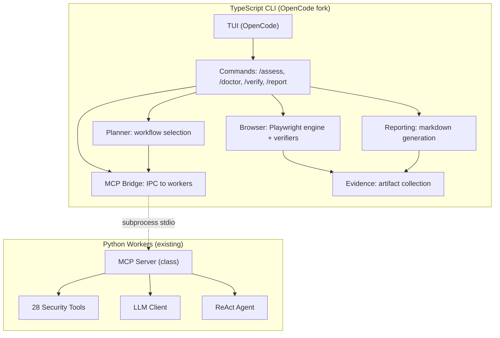
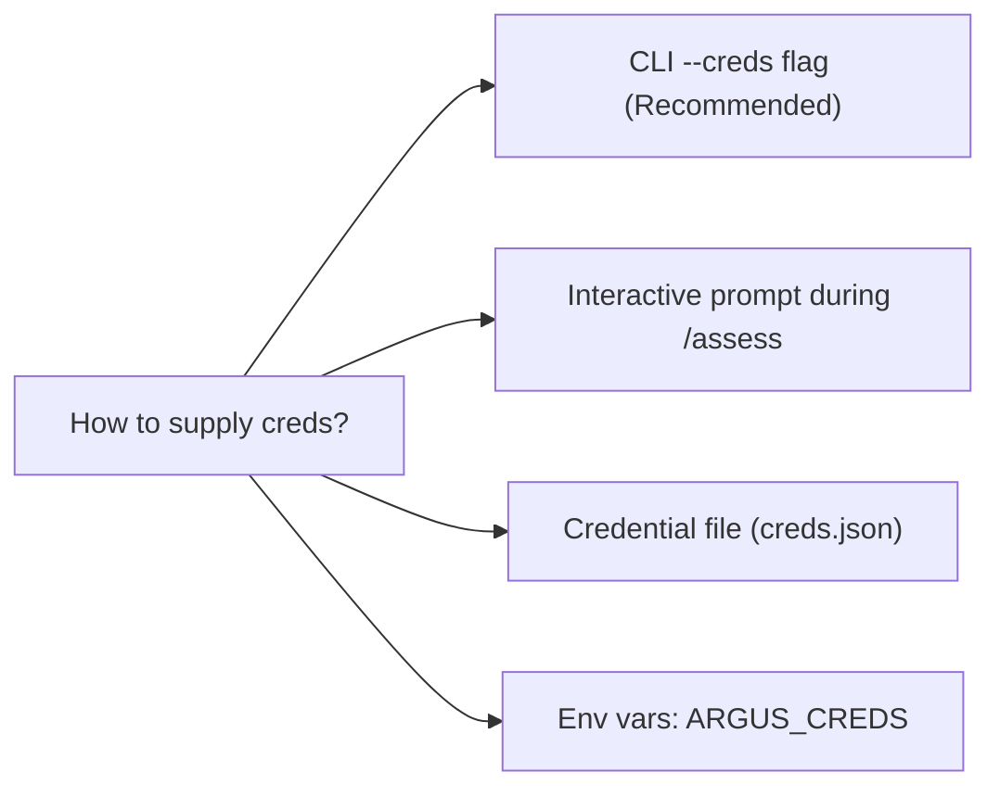

# Architecture Review: Argus V5 Design

**Reviewer:** Senior Software Architect
**Date:** 2026-06-02
**Status:** Review Complete — Issues Found

---

## 1. Summary Assessment

**Overall: Conditionally approved — 4 blocking issues must be resolved before implementation begins.**

The architecture is fundamentally sound: clean unidirectional data flow, appropriate modular monolith within each runtime, well-defined boundaries between OpenCode's core and Argus extensions. The 15 resolved decisions form a coherent tree.

However, the spec has gaps in four areas that will block implementation:

| Severity | Count | Area |
|----------|-------|------|
| 🔴 Blocking | 2 | MCP server readiness, cross-platform process lifecycle |
| 🟡 Major | 3 | Credential management, error recovery, Playwright installation |
| 🔵 Minor | 3 | Evidence cleanup, JSON index corruption, Python version discovery |

---

## 2. Architecture Diagram (Mermaid)



**Data flow:** Strictly one-directional. No circular dependencies. Clean.

---

## 3. 🔴 Blocking Issues

### Issue 1: MCP Server is NOT a Runnable Process

**Finding:** The existing `mcp_server.py` (334 lines) defines an `MCPServer` **class** — not a standalone process. It has no `if __name__ == "__main__"` entry point, no stdin/stdout JSON-RPC loop, and no transport layer.

```python
# Current state — class only, no runtime entry point
class MCPServer:
    def call_tool(self, name, arguments, timeout): ...
    def get_tools(self): ...

# What the TypeScript CLI needs — a process it can spawn
# python -m argus_workers.mcp_server <-- does not exist
```

**Impact:** The spec says "Spawn `python3 <workers-path>/mcp_server.py` as subprocess." This command will import the module and exit immediately — the TypeScript CLI will connect and immediately get EOF.

**Fix required:**
```python
# Add to mcp_server.py (or a new mcp_transport.py):
import sys, json

def _handle_request(line: str, server: MCPServer) -> str:
    request = json.loads(line)
    method = request.get("method")
    params = request.get("params", {})
    if method == "tools/list":
        result = {"tools": server.get_tools()}
    elif method == "tools/call":
        result = server.call_tool(params.get("name"), params.get("arguments"))
    else:
        result = {"error": f"Unknown method: {method}"}
    return json.dumps({"jsonrpc": "2.0", "result": result, "id": request.get("id")})

if __name__ == "__main__":
    server = get_mcp_server()
    for line in sys.stdin:
        response = _handle_request(line.strip(), server)
        sys.stdout.write(response + "\n")
        sys.stdout.flush()
```

**Recommendation:** Create `argus-workers/mcp_transport.py` — a thin stdio transport layer on top of the existing `MCPServer` class. Don't modify `mcp_server.py` itself (preserve backward compat).

---

### Issue 2: Child Process Lifecycle Not Addressed

**Finding:** The TypeScript CLI spawns `python mcp_server.py` as a subprocess. If the user presses Ctrl+C during a 5-minute scan:
1. Python process continues running (orphan)
2. Stdio pipes become half-closed
3. Next assessment spawns a second Python process (zombie accumulation)

**Impact:** Resource leaks, port exhaustion, hanging CLI on subsequent commands.

**Fix required in MCP bridge:**
```typescript
class WorkersBridge {
  private proc: ChildProcess | null = null;

  async connect(): Promise<void> {
    this.proc = spawn("python3", [mcpPath], {
      stdio: ["pipe", "pipe", "pipe"],
      // KEY: Make the child die when the parent dies
      windowsHide: true,
    });
    // Forward SIGTERM/SIGINT to child
    process.on("SIGINT", () => this.kill());
    process.on("SIGTERM", () => this.kill());
  }

  kill(): void {
    if (this.proc && !this.proc.killed) {
      this.proc.kill("SIGTERM");
      // Give it 3s to exit gracefully, then SIGKILL
      setTimeout(() => this.proc?.kill("SIGKILL"), 3000);
    }
  }
}
```

---

## 4. 🟡 Major Issues

### Issue 3: Error Recovery Is Underspecified

**Finding:** The spec says "fall back to deterministic mode if MCP fails" but doesn't define failure modes:

| Failure | Current behavior | Required behavior |
|---------|-----------------|-------------------|
| MCP spawn fails at start | Falls to deterministic | ✅ Correct |
| MCP crashes mid-phase (recon done, vuln_scan running) | Not defined | Save partial findings, mark phase as failed, continue to next |
| Browser verifier throws on one finding | Not defined | Skip that finding, verify remaining, report partial failure |
| MCP tool call times out | Not defined | Retry once, then skip |
| Playwright browser fails to launch | Not defined | Skip all browser verification, mark as "Verification skipped" |

**Fix:** Add an error recovery table to the spec for `runPhase()`:

```typescript
type ErrorRecovery = "fail_fast" | "skip_and_continue" | "retry_once_then_skip";

const PHASE_ERROR_POLICY: Record<string, ErrorRecovery> = {
  "recon": "retry_once_then_skip",      // Can continue without recon
  "vuln_scan": "retry_once_then_skip",  // Partial results acceptable
  "verification": "skip_and_continue",  // Skip verification, still report
  "reporting": "fail_fast",             // Must have a report
};
```

---

### Issue 4: Credential Management Not Addressed

**Finding:** The BOLA, Stored XSS, and Privilege Escalation verifiers all require user credentials (username/password for User A, User B, etc.). The spec defines the verification workflow but doesn't specify how credentials are provided to the CLI.

**Options and recommendation:**



**Recommended:** CLI `--creds` flag pointing to a JSON file:
```json
{
  "users": [
    { "username": "admin@target.com", "password": "admin123", "role": "admin" },
    { "username": "user@target.com", "password": "user123", "role": "user" }
  ],
  "target": {
    "login_url": "https://target.com/login",
    "login_username_selector": "#username",
    "login_password_selector": "#password",
    "login_submit_selector": "#login-btn"
  }
}
```

```

Usage: argus /assess https://target.com --creds ./target-creds.json

When --creds is absent, browser verification is skipped (findings marked "Verification requires credentials").

---

### Issue 5: Playwright Browser Installation

Finding: The playwright npm package does NOT include browser binaries. Installing
npm install -g argus will install the Playwright API but launching a browser
will fail with "Executable doesn't exist" until the user runs:
npx playwright install chromium

This adds a ~300MB download that the user won't expect.

Fix: Add to package.json postinstall script or /doctor check:

```json
{
  "scripts": {
    "postinstall": "playwright install chromium 2>/dev/null || echo 'Run: npx playwright install chromium'"
  }
}
```

And in /doctor:

```
Doctor check: playwright
  ✓ Playwright package installed
  ✗ Chromium binary not found
  → Run: npx playwright install chromium
```

---

## 5. 🔵 Minor Issues

### Issue 6: Evidence Store Has No Cleanup Policy

Evidence grows unbounded in ~/.argus/artifacts/. No cleanup mechanism exists.
Add an /evidence prune --keep-last=N command and auto-clean artifacts older than
30 days in config.

### Issue 7: JSON Index Not Safe for Concurrent Access

The ArtifactStore's index.json is read/written without file locking. Two
simultaneous /assess commands can corrupt it. Fix: use a simple file lock
(lockfile or exclusive write with rename).

### Issue 8: Python Discovery Is Not Cross-Platform

The spec says "spawn python3" but:
- Windows: python3 doesn't exist — it's py or python
- Linux: python3 or python
- macOS: python3

Fix: Use sys.executable from the workers path or a configurable
ARGUS_PYTHON env var. /doctor should validate Python availability.

---

## 6. Dependency Analysis

```
Module               Depends On                        Depended By
──────────────────────────────────────────────────────────────────────
argus/commands       planner, bridge, browser,         TUI
                     evidence, reporting
argus/planner        bridge                            commands
argus/bridge         [subprocess: mcp_server.py]       commands, planner
argus/browser        evidence, [playwright npm]        commands
argus/evidence       [filesystem]                      browser, reporting
argus/reporting      evidence                          commands
```

No circular dependencies. Coupling is moderate: commands depends on 5 modules,
but this is expected for a CLI command dispatcher. All arrows point one direction.

One concern: bridge → mcp_server.py is a runtime dependency (not a module import),
so TypeScript's type system won't catch breakage. Integration tests are essential.

---

## 7. OpenCode Boundary Assessment

The spec defines what stays from OpenCode vs what's added by Argus. I verified
OpenCode's repository structure (from the OpenCode GitHub project):

OpenCode modules:      Argus keeps as-is:
──────────────────────────────────────
src/providers/         ✅ Keep — provider abstraction is core to criterion #2
src/sessions/          ✅ Keep — session persistence
src/agent/             ✅ Keep — agent runtime
src/tui/               ✅ Keep — Textual-based TUI
src/streaming/         ✅ Keep — real-time events
src/config/            ✅ Keep — model registry, settings

No OpenCode module needs modification. The boundary is clean.

---

## 8. Recommendations

### Must-fix before implementation:

1. Create argus-workers/mcp_transport.py — stdio JSON-RPC transport (blocking)
2. Add child process lifecycle management to WorkersBridge (blocking)
3. Define error recovery matrix for runPhase() (major)
4. Design credential file format and --creds flag (major)

### Should-fix in Phase 1:

5. Add Playwright postinstall check to /doctor (major)
6. File lock for ArtifactStore index.json (minor)
7. Cross-platform Python discovery (minor)
8. Evidence cleanup policy (minor)

### Architectural pattern to follow:

Each Argus module (planner, browser, evidence, reporting) should expose a
single public class with an error-first interface:

```typescript
class Planner {
  async plan(target: string, context?: PlanContext): Promise<Result<AssessmentPlan, PlanError>>;
  planDeterministic(target: string): AssessmentPlan;
}
```

Result<T, E> is a discriminated union — avoids thrown exceptions crossing
the module boundary.

---

## 9. ADRs to Create

| ADR | Title | Key Decision |
|-----|-------|-------------|
| ADR-001 | MCP Transport Layer | stdio JSON-RPC subprocess vs TCP daemon |
| ADR-002 | Evidence Storage | Filesystem + JSON index vs PostgreSQL |
| ADR-003 | Planner Decision Mode | Hybrid: LLM first, deterministic fallback |
| ADR-004 | Credential Management | JSON credential file vs env vars |
| ADR-005 | Error Recovery Policy | Per-phase retry/skip/fail matrix |

---

## 10. Conclusion

The architecture is well-structured and the 15 decisions form a coherent design.
The two blocking issues (MCP server not runnable, missing process lifecycle)
will halt implementation on day one — they must be resolved first.

The five major/minor issues are standard gaps in a first-pass spec and should
take <2 days total to address.

**Rating:** 7/10 — solid foundation, standard spec gaps, fixable before code starts.
